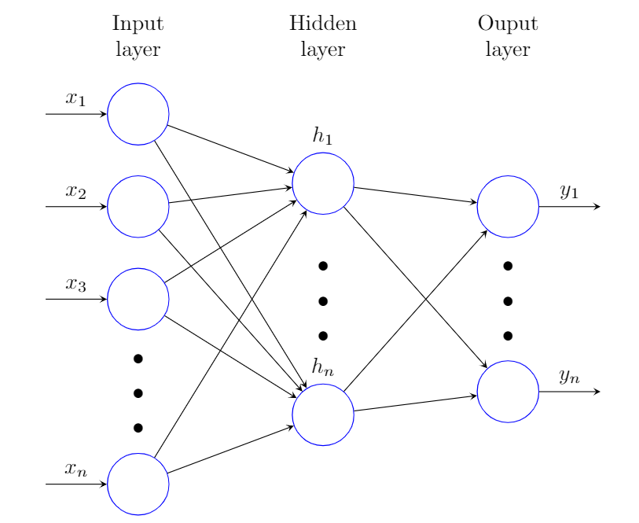
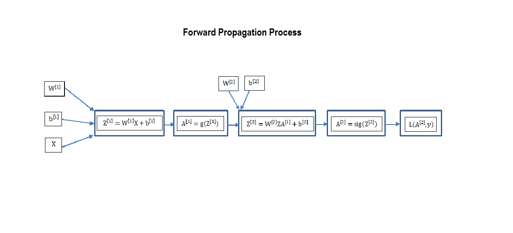
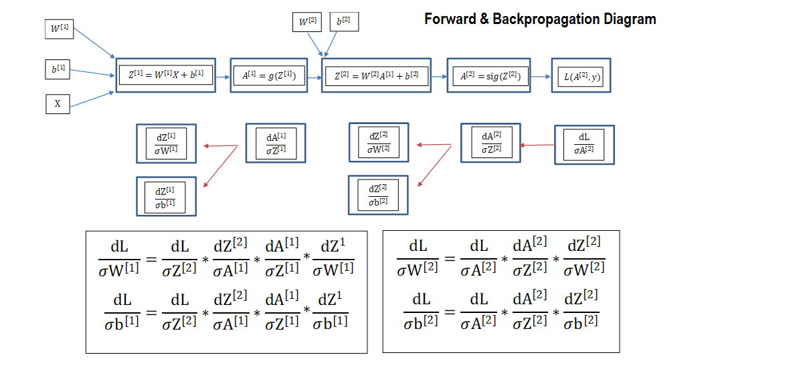

# Welcome to my Github Page 
## Ride Hard or Stay Home 


### Project Description
LogisticAnn is a personal project/memo developed with the goal to thoroughly study Neural Networks along with Backpropagation and a plethora of gradient based optimization techniques used in the field.  During this journey, we will also derive all the formulas and implement the ensemble in a python class called LogisticAnn. The longer goal is to learn the mathematics underlying Neural Networks enough to be able to design and implement bespoke solutions adapted to specific problems as needed. In addition, this memo will serve as a reference point for upcoming projects. 

### Definition of Neural Networks
Artificial neural networks or connectionist systems are computing systems inspired by the biological neural networks that constitute animal brains. Such systems "learn" to perform tasks by considering examples, generally without being programmed with task-specific rules.

### Components:


Neural Networks consist of 3 type of layers: 1. Input layer, 2. Hidden layers, 3. Output layer. In the example above it is a one-layer NN (We do not count input & output layers). Each layer consists of one or several neurons (blue circles in the diagram above) that get activated by an activation function. There are several activation functions used, in this project, our class gives the option to either use “tanh – Hyperbolic Tangent” or ” Relu – Rectified Linear Unit” functions for the hidden layers and will use the sigmoid for the output layer. 

### Computation:
There are three steps in the computation process of Neural Networks: 
The optimization underlying Neural Networks computations is based on gradients. Hence, there are 2 main steps in the optimization: 
#### 1. Initialization:
Initialization of the weights is done once; only at the beggining of the process. The initialization process can have drastic impact on the convergence as well as the speed of the algorithm. We chose to initialize our weights such that are normally distributed with mean of 0 and variance   where  is the the numbers of neurons in the previous layer. The bias unit  is initialized to 0.<br>

 <br>


More information on initialization as well as on the issues of exploding and vanishing gradients can be found here: 
```rmarkdown
https://www.deeplearning.ai/ai-notes/initialization/
```
Initialization code:
```python
def _initialize_parameters(self,layer_dim):
        """
        Arguments:
            layer_dim  <- a list containing the dimentions of each layer in the network
        Returns:
            Parameters <- a dictionary containing parameters "W1","b1".."Wl","bl"...."WL","bL". where "L" is the number of the final output layer in the network
                            "Wl" - Matrix of weights of shape (layer_dim(l),layer_dim(l-1))
                            "bl  - Vector of the bias nodes of shape (leyer_dim(l),1)
        """
        np.random.seed(3) # Fixing the seed in order to get the same result (helps for debugging)
        parameters = {}
        L = len(layer_dim) 
        for l in range(1,L):
            parameters["W" + str(l)] = np.random.randn(layer_dim[l],layer_dim[l-1]) *  2 / np.sqrt(layer_dim[l-1])# the purpose of the perturb is to make the initialized weights very close to 0
            parameters["b" + str(l)] = np.zeros((layer_dim[l],1))
            # Just to make sure that each weight and bias matrix is of the appropriate shape
            assert(parameters["W" + str(l)].shape == (layer_dim[l],layer_dim[l-1]))
            assert(parameters["b" + str(l)].shape == (layer_dim[l],1))
        
        return parameters

```


#### 2.Forward Propagation:  
  The forward propagation algorithms’ task is to propagate the information forward from the input to the output layers using a          combination of two functions of which one is linear, the second is the activation function. The algorithm describing the forward propagation process for a one hidden layer network is as follow:



Where:

 <- is the input matrix with dimensions (n,m); "n" being the number of features and "m" the training sample size.

 <- is the bias unit at each layer of size  where  is size of layer  and "m" is the training sample size. 

 <- is the weight matrix of size  where  and  represent the size of the previous and current layer respectively.  are also the target variables of our problem.  

 <-  is the activation function for layer . Our class gives the option to use a "relu" or "tanh" functions.<br>
   <u>relu:</u> <br>   <br>

   <u>tanh:</u><br>   
   
 <- is an activation function applied solonely to the last layer.<br> 

 

The method responsible to propagate information from layer to layer is described below: 
```python
 def _forwardProp(self,A_prev, W, b, activation):
        """
        Implementation of the forward propagation algorithm
        Arguments:
            A_prev     <- The activation matrix results of the previous layer of shape (number of nodes in the previous layer, m)
            W          <- Matrix of weights of the current layer of shape (number of nodes in the current layer, number of nodes in the previous layer)
            b          <- Matrix of bais units of the current layer of shape (number of nodes in the current layer,1)
            activation <- The activation function used to activate the current layer. stored as a text string: "sigmoid","relu" or "tanh"
        Returns:
            A          <- The activation matrix results of the current layer of shape (number of nodes in the current layer, m)
            cache      <- a tuple containing (A_prev,W,b,Z)
        """
        Z = np.dot(W,A_prev) + b # the linear activation
        if activation == "sigmoid":
            A = self._sigmoid(Z)
        elif activation == "relu":
            A = self._relu(Z)
        elif activation == "tanh":
            A = np.tanh(Z)
        
        cache = (A_prev,W,b,Z)
        
        return A,cache

```
#### 3.Backpropagation: 
Backpropagation "Backpropagation of errors" is algorithm used in the training process of Neural Networks. It is based on the chain rule od derivative calculus and helps us calculate the gradients of the target variables (W,b) with respect to the Loss function L.   


##### Gradients Calculation:


Backpropagation snippet:
```python
def _backProp(self,dA,cache,activation):
        """
        Implement the backward propagation using linear backprop function.
        
        Arguments:
        dA         <- post-activation gradient for current layer l 
        cache      <- a tuple containing (A_prev,W,b,Z) of the current layer
        activation <- the activation to be used in this layer, stored as a text string: "sigmoid", "relu" or "tanh"
        
        Returns:
        dA_prev    <- Gradient of the cost with respect to the activation (of the previous layer l-1), same shape as A_prev
        dW         <-Gradient of the cost with respect to W (current layer l), same shape as W
        db         <-Gradient of the cost with respect to b (current layer l), same shape as b
        """
        
        
        if activation == "sigmoid":
            dZ = self._sigmoid_backward(dA,cache)
            dW,db,dA_prev = self._linear_backward(dZ,cache)
            return dW,db,dA_prev
        elif activation == "relu":
            dZ = self._relu_backward(dA,cache)
            dW,db,dA_prev = self._linear_backward(dZ,cache)
            return dW,db,dA_prev
        elif activation == "tanh":
            dZ = self._tanh_backward(dA,cache)
            dW,db,dA_prev = self._linear_backward(dZ,cache)
            return dW,db,dA_prev
            

    def _L_model_backProp(self,AL, Y ,activation ,caches,lambd):
        """
        Implement the backward propagation for the (relu or tanh) * (L-1) -> LINEAR -> SIGMOID last layer L
        
        Arguments:
        AL         <- probability vector, output of the forward propagation (L_model_forwardProp())
        Y          <- true "label" target variable in the supervised learning problem size (1,m)
        Activation <- the activation to be used in the hidden, stored as a text string:  "relu" or "tanh"
        caches     <- list of caches containing all caches for each layer. each cache is a tuple containing  (A_prev,W,b,Z) 

                    
        Returns:
        grads -- A dictionary with the gradients
                grads["dA" + str(l)] = ... 
                grads["dW" + str(l)] = ...
                grads["db" + str(l)] = ... 
        """
        grads ={}
        L = len(caches) # The number of layers
        m = AL.shape[1] # number of training examples
        Y = Y.reshape(AL.shape)

        epsilon = 1e-7

        # Starting back propagation by computing dAL given a sigmoid activation function for the last layer L  
        dAL = np.divide(-19 * Y,AL+epsilon) + np.divide((1-Y),(1-AL)+epsilon)
        
        # retrieving the cache tuple of layer L
        cache_L = caches[L-1]
        _, W, _,_ = cache_L
        # getting the gradient of layer L
        grads["dW"+str(L)],grads["db"+str(L)],grads["dA"+str(L-1)] = self._backProp(dA=dAL,cache = cache_L,activation="sigmoid")
        grads["dW"+str(L)] = grads["dW"+str(L)] + (lambd/m) * W

        #loop from l=L-2 to l=0 to calculate the rest of the gradient through each layer
        for l in reversed(range(L-1)):
            cache_l = caches[l]
            _, W, _,_ = cache_l
            dW_temp,db_temp,dA_prev_temp =  self._backProp(grads["dA"+str(l+1)],cache_l,activation)
            grads["dA"+str(l)]   = dA_prev_temp
            grads["dW"+str(l+1)] = dW_temp + (lambd/m) * W
            grads["db"+str(l+1)] = db_temp

        return grads
```


```markdown

\sqrt{2}
$\sqrt{2}$.
# Header 1
## Header 2
### Header 3

- Bulleted
- List

1. Numbered
2. List

**Bold** and _Italic_ and `Code` text

[Link](url) and 
```

For more details see [GitHub Flavored Markdown](https://guides.github.com/features/mastering-markdown/).


### Support or Contact

