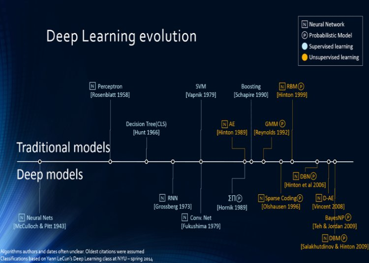

## Welcome to my Github page: 


### History of Neural Networks
Warren McCulloch and Walter Pitts (1943) opened the subject by creating a computational model for neural networks. In the late 1940s, D. O. Hebb created a learning hypothesis based on the mechanism of neural plasticity that became known as Hebbian learning. Farley and Wesley A. Clark (1954) first used computational machines, then called "calculators", to simulate a Hebbian network. Rosenblatt (1958) created the perceptron. The first functional networks with many layers were published by Ivakhnenko and Lapa in 1965, as the Group Method of Data Handling. The basics of continuous backpropagation were derived in the context of control theory by Kelley in 1960 and by Bryson in 1961, using principles of dynamic programming.
In 1970, Seppo Linnainmaa published the general method for automatic differentiation (AD) of discrete connected networks of nested differentiable functions. In 1973, Dreyfus used backpropagation to adapt parameters of controllers in proportion to error gradients.Werbos's (1975) backpropagation algorithm enabled practical training of multi-layer networks. In 1982, he applied Linnainmaa's AD method to neural networks in the way that became widely used.Thereafter research stagnated following Minsky and Papert (1969), who discovered that basic perceptrons were incapable of processing the exclusive-or circuit and that computers lacked sufficient power to process useful neural networks. In 1992, max-pooling was introduced to help with least shift invariance and tolerance to deformation to aid in 3D object recognition. Schmidhuber adopted a multi-level hierarchy of networks (1992) pre-trained one level at a time by unsupervised learning and fine-tuned by backpropagation.
The development of metal–oxide–semiconductor (MOS) very-large-scale integration (VLSI), in the form of complementary MOS (CMOS) technology, enabled the development of practical artificial neural networks in the 1980s. A landmark publication in the field was the 1989 book Analog VLSI Implementation of Neural Systems by Carver A. Mead and Mohammed Ismail.
Geoffrey Hinton et al. (2006) proposed learning a high-level representation using successive layers of binary or real-valued latent variables with a restricted Boltzmann machine to model each layer. In 2012, Ng and Dean created a network that learned to recognize higher-level concepts, such as cats, only from watching unlabeled images. Unsupervised pre-training and increased computing power from GPUs and distributed computing allowed the use of larger networks, particularly in image and visual recognition problems, which became known as "deep learning".
Ciresan and colleagues (2010) showed that despite the vanishing gradient problem, GPUs make backpropagation feasible for many-layered feedforward neural networks. Between 2009 and 2012, ANNs began winning prizes in ANN contests, approaching human level performance on various tasks, initially in pattern recognition and machine learning. For example, the bi-directional and multi-dimensional long short-term memory (LSTM) of Graves et al. won three competitions in connected handwriting recognition in 2009 without any prior knowledge about the three languages to be learned.
source: https://en.wikipedia.org/wiki/Artificial_neural_network#History


### Project Description
LogisticAnn is a personal project/memo developed with the goal to thoroughly study Neural Networks along with Backpropagation and a plethora of gradient based optimization techniques used in the field.  During this journey, we will also derive all the formulas and implement the ensemble in a python class called LogisticAnn. The longer goal is to learn the mathematics underlying Neural Networks enough to be able to design and implement bespoke solutions adapted to specific problems as needed. In addition, this memo will serve as a reference point for future research. 

### Definition of Neural Networks
Artificial neural networks or connectionist systems are computing systems vaguely inspired by the biological neural networks that constitute animal brains. Such systems "learn" to perform tasks by considering examples, generally without being programmed with task-specific rules.

### Components:


Neural Networks consist of 3 type of layers: 1. Input layer, 2. Hidden layers, 3. Output layer. In the example above it is a one-layer NN (We do not count input & output layers). Each layer consists of one or several neurons (blue circles in the diagram above) that get activated by an activation function. There are several activation functions used, in this project, our class will give the option to either use “tanh – Hyperbolic Tangent” or ” Relu – Rectified Linear Unit” functions for the hidden layers and will use the sigmoid for the output layer. 

###Computation:
The optimization underlying the Neural Networks computation is based on gradients. Hence, there are 2 main steps in the optimization: 
  #### 1.The forward propagation:  
  The forward propagation algorithms’ task is to propagate the information forward from the input to the output layers using a          combination of two functions of which one is linear, the second is the activation function. The algorithm describing the forward propagation process for a one hidden layer network is as follow:


\begin{equation}
\sqrt{2}
$\sqrt{2}$.

\end{equation}


```markdown

\sqrt{2}
$\sqrt{2}$.
# Header 1
## Header 2
### Header 3

- Bulleted
- List

1. Numbered
2. List

**Bold** and _Italic_ and `Code` text

[Link](url) and 
```

For more details see [GitHub Flavored Markdown](https://guides.github.com/features/mastering-markdown/).


### Support or Contact

